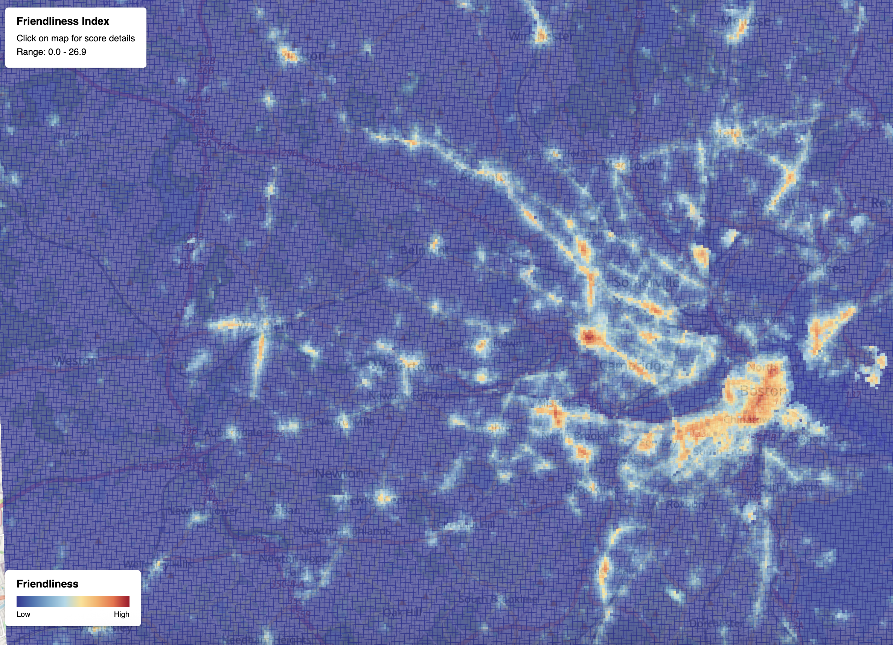

# Friendliness Index
A way to visualize the friendliest places to walk.

Generates a heatmap, e.g. greater Boston area:



## Procedure
1. From OpenStreetMap data, generate a connected graph of all walkable ways (sidewalks, paths, etc).
2. From OpenStreetMap data, extract a list of "friendly" POIs (shops, cafes, etc). Snap POIs to the nearest graph node.
3. Generate a rectangular grid covering the bounding box. Grid points too far from the walk graph (e.g., in water) are excluded.
4. For each grid point, run truncated Dijkstra to find nearby POIs and compute a weighted sum using kernel decay (exponential by default).

Note: this algorithm does not weight street safety or aesthetics - no bonuses for wide sidewalks,
slow traffic, speedbumps, bike lanes; no penalties for parking lots. It aims to visualize
"friendliness" as in "open front doors", not "walkability" which has already been covered by others.


## Usage
1. Clone repo and install dependencies:
```
python3 -m venv venv
source venv/bin/activate
pip install -r requirements.txt
```
1. Download a PBF file containing the OSM data for your area. If using a large regional extract,
   consider pre-clipping to your area of interest with osmium (`brew install osmium-tool`):
   ```
   osmium extract --bbox=-74.02,40.70,-73.90,40.88 new-york.osm.pbf -o manhattan.osm.pbf
   ```
1. Pick out a bounding box. Allow a few hundred extra meters on all sides so that edges of the grid can have the same number of neighbors as the center.
1. Run the script:

```
python3 generate.py \
  --pbf massachusetts-251213.osm.pbf \                 # Input file e.g. from Geofabrik
  --bbox="-71.323487,42.184944,-70.921937,42.522139" \ # Bounding box (lon,lat,lon,lat)
  --lambda 120 \                                       # Exponential decay parameter, shorter=faster decay
  --rmax 800 \                                         # Max influence radius
  --cell-size 25 \                                     # Grid cell width in meters
  --out output_large                                   # Output directory
```

## Authorship
Written using Claude Code. See `spec.txt` for the initial prompt and `spec_alterations.txt`
for improvements discovered during implementation.
